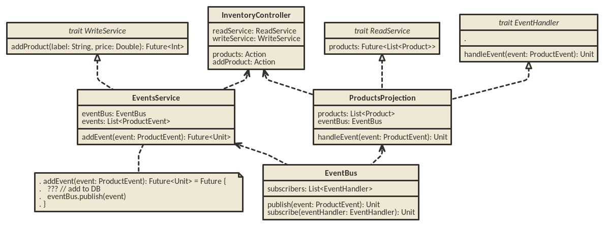

# Scala Play CQRS example

Scala Play training exercice with CQRS architecture.

## Use

    sbt run

## Routes

### `app/controllers/InventoryController.scala`

* GET `/products`: list all products
* GET `/product/:label`: find a product by label
* POST `/product`: add new product
* DELETE `/product/:id`: delete product with id `id`
* PUT `/product/:id/label`: change the `label` of the product with id `id`
* PUT `/product/:id/price`: change the `price` of the product with id `id`

## CQRS architecture

Source file: [cqrs.nomnoml](./cqrs.nomnoml)

[http://www.nomnoml.com/](http://www.nomnoml.com/)
